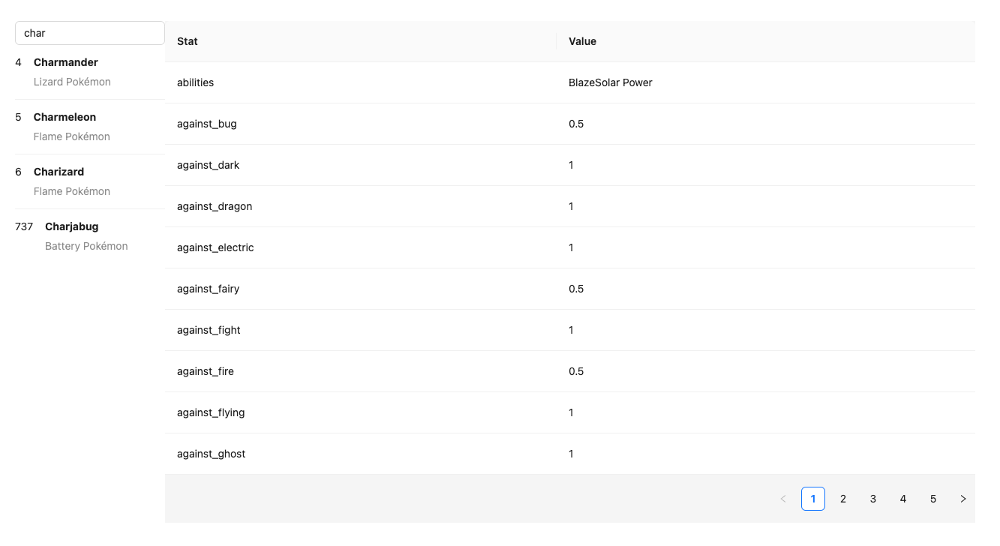

# Temporal Challenge

Note: Made from Vite

## Steps

1. Run `npm install`
2. Run `npm run dev`

## Includes

- Error handling & result caching from SWR
- Options to add chaos and flakiness
- Debounce when typing
- A display of stats of a Pokemon

## Screenshots

